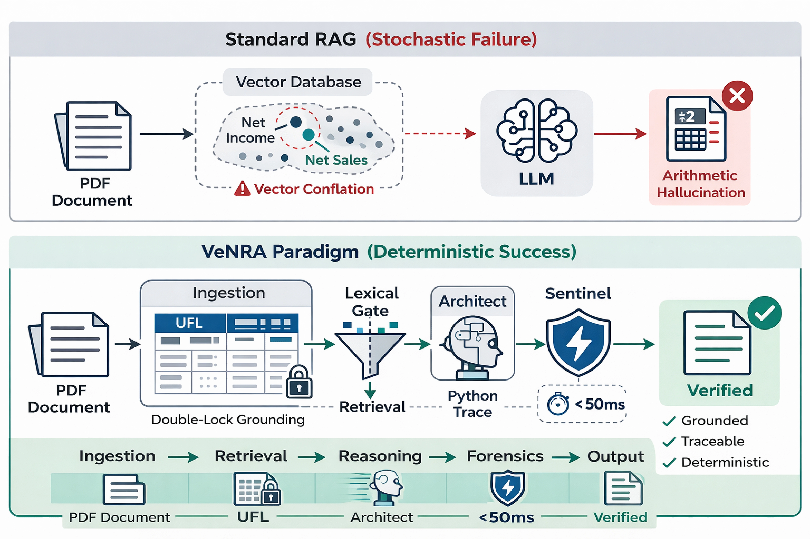

# VeNRA: Verifiable Numerical Reasoning Agent

> **"Trust, but Verify."** — The core philosophy of Financial AI.

 

VeNRA is an agentic **Financial one-turn QA System** designed to solve the "Stochastic Inaccuracy" problem in Large Language Models. It enables users to ask complex numerical questions about complex financial data such as 10-K filings (e.g., *"What was the Debt-to-Equity ratio in 2026?"*) and receive answers that are **mathematically deterministic**, **fully traceable**, and **audited in real-time**.

## 🟢 The VeNRA Solution

VeNRA moves beyond simple "Text Retrieval" to a **Hybrid Neuro-Symbolic Architecture**. instead of asking the LLM to *output* the answer, we empower it with verifiable *structured facts* to *calculate* the answer.

### Key Features

*   **🛡️ Zero-Hallucination Math:** Arithmetic is performed by deterministic code execution, not by predicting the next token.
*   **🔗 Deep Traceability:** Every number in an answer is explicitly linked to a specific row in the financial statements and a specific text chunk in the source PDF.
*   **🤖 The Sentinel (Audit Layer):** A specialized "Judge" model reviews every answer against the source data before it is shown to the user, providing a "Groundedness Score" for confidence.
*   **⚡ Hybrid Retrieval:** Combines semantic search (for concepts) with structured filtering (for precise metrics) to ensure the right data is found every time.

## 🚀 Getting Started

### Prerequisites
*   Python 3.11+
*   API Keys (for reasoning, parsing, monitoring).

### Installation

1.  **Clone the Repository:**
    ```bash
    git clone https://github.com/pagand/VeNRA.git
    cd VeNRA
    ```
2.   **Configure:**
    Create a `.env` file in the root directory:
    ```bash
    cp .env.example .env && nano .env # update with your credential
    ```


3.  **Set Up Environment:**
We have different dependencies for each phase (1) training and (2) serving. You do not have to install both. 

#### Option 1: Automatic (for training only)

```bash
chmod +x setup.sh
./setup.sh
source .venv/bin/activate
```

#### Option 2: Manual (for training)

3.1. Create virtual environment
```bash
python3.11 -m venv .venv
source .venv/bin/activate
```

3.2. Upgrade pip
```bash
pip install --upgrade pip setuptools wheel
```

3.3. Install PyTorch (for CUDA>13.0)
```bash
pip install torch==2.5.1 torchvision==0.20.1 torchaudio==2.5.1 \
    --index-url https://download.pytorch.org/whl/cu124
```

3.4. Install remaining dependencies
```bash
pip install triton==3.1.0 bitsandbytes==0.43.3
```

3.5. Verify installation
```bash
python << 'EOF'
import torch, bitsandbytes as bnb, triton
print(f"✓ PyTorch {torch.__version__}")
print(f"✓ CUDA {torch.version.cuda}")
print(f"✓ triton {triton.__version__}")
print(f"✓ bitsandbytes {bnb.__version__}")
print(f"✓ GPU: {torch.cuda.get_device_name(0)}")
EOF
```

3.6. Install remaining dependencies
```bash
pip install -r requirements_training.txt
```

#### Option 3: Manual (for serving)
3.1. Create virtual environment
```bash
python3.11 -m venv .venv
source .venv/bin/activate
```

3.2. Install remaining dependencies
```bash
pip install -r requirements_serving.txt
```

4.  (for training): **Start training**
```bash
python3 src/hal_det/training/train.py --output_dir ./data/outputs
```

# Quick test (1% of epoch)
```bash
python src/hal_det/training/train.py --output_dir ./test --num_train_epochs 0.01
```


# Resume from checkpoint
```bash
python src/hal_det/training/train.py --output_dir ./data/outputs --resume_from_checkpoint ./data/outputs/checkpoint-500
```

4.  (for serving):
**Run the Service**
    ```bash
    uvicorn venra.main:app --reload --app-dir src
    ```
    The Sentinel Service is now active at `http://localhost:8000`.

## 🏗️ Architecture Vision

VeNRA is built on a modular, service-oriented architecture:
1.  **Ingestion Engine:** Converts unstructured PDFs into a structured "Fact Ledger."
2.  **Runtime Agent:** A program-aided agent that generates and executes Python code to answer queries.
3.  **Sentinel Service:** An independent API that acts as the final gatekeeper for quality assurance.

## 🤝 Contributing

This project is an active research prototype. We welcome contributions, especially in:
*   Improving the extraction of complex tables.
*   Enhancing the "Judge" model's ability to detect subtle hallucinations.
*   Building a frontend dashboard for trace visualization.

## 📄 License

Please reach out to us for enterprise and commercial licensing. Contact us at info@upaspro.com.

This project is licensed under the terms of the license included here [Creative Commons Attribution-NonCommercial-ShareAlike 4.0 International License](https://creativecommons.org/licenses/by-nc-sa/4.0/).

## 💬 How to Cite
```
 @article{agandneuro,
  title={Neuro-Symbolic Financial Reasoning via Deterministic Fact Ledgers and Adversarial Low-Latency Hallucination Detector},
  author={Agand, Pedram},
  journal={arXiv preprint arXiv:2603.04663},
  year={2026}
}
```
